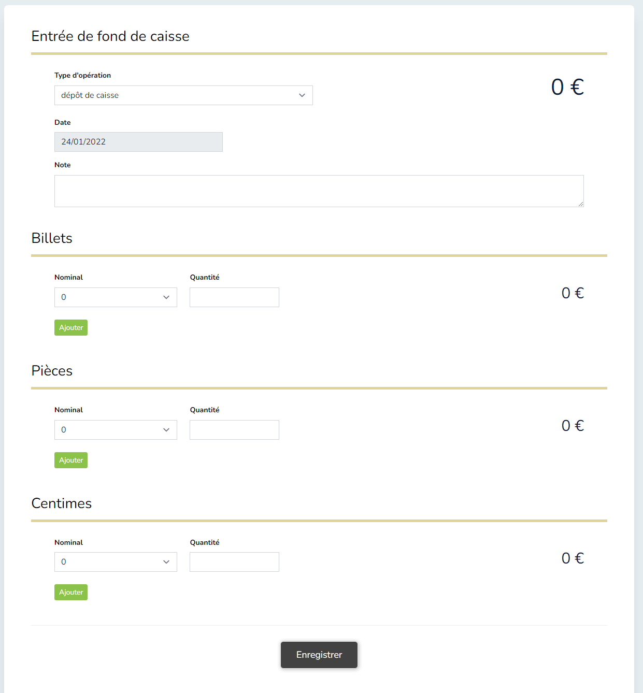
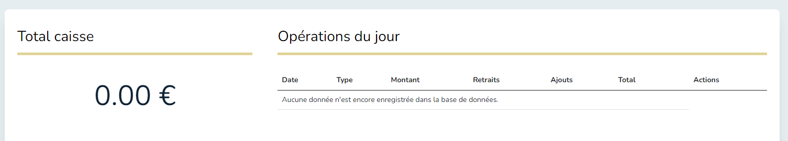

# Caisse du jour
### Objectif
Créer une interface pour l'opération d'une caisse de jour qui enregistre des encaissements en billets, pièces et centimes et en fait le récapitulatif.

### Requis : 

1. Réaliser sous le framework Laravel 9

3. Avec système de login 
   1. (sans la partie mot de passe oublié)
   2. (sans création de compte, compte admin par défaut)
   
3. L'UI doit se composer des éléments suivants :

   1. #### Page de saisie :
      1. Type d'opération : (gérés séparément, voir fin)
         1. dépôt de caisse (ajoute à la caisse)
         2. remise en banque (retire de la caisse)
         3. retrait (retire de la caisse)
      2. Date de la saisie : datepicker au format d/m/Y et qui enregistre en base de données avec le format Y-m-d
      3. Commentaire sur l'enregistrement : texte libre
      4. Bloc de saisie pour chaque type de numéraire :
         1. Billets
         2. Pièces
         3. Centimes
      5. Chaque bloc de saisie doit se composer de :
         1. champ select listant les nominaux possibles pour le type de monnaie (réf. EURO)
         2. champ pour saisie de la quantité 
         3. bouton ajouter qui permet d'ajouter / cumuler plusieurs ajouts au sein du même bloc (ex 5 x 2, 10 x4, etc). On doit pouvoir supprimer une ligne rajoutée.
         4. espace de calcul et affichage automatique à chaque manipulation du bloc. Ex: je choisis dans le select 5 puis en quantité j'indique 3, le champ d'affichage doit afficher 15
      6. Un affichage global qui affiche le total de la saisie en temps réel, calé sur les affichages récapitulatifs individuels de chaque bloc de saisie numéraire.
      7. Toutes les manipulations de la page de saisi se font par Javascript / Jquery. L'enregistrement final se fait par requête POST classique.\
         &nbsp;
      \
      UI attendue :

         

   2. ####Page type dashboard qui récapitule :
      1. les enregistrements par jour sous forme de tableau pour chaque ligne :
         1. date
         2. sous-total opérations de retrait
         3. sous-total opérations d'ajout
         4. total
         5. édition : action qui permet de modifier la saisie de ce jour
         6. suppression: action qui permet de supprimer la saisie de ce jour avec demande de confirmation préalable
      2. le total des enregistrements

  3. #### Interface d'ajout / rédaction / suppression des types d'opérations :
     1. Liste
     2. Edition
     3. Suppression\
        &nbsp;
        
4. Le projet doit être déployé sur **GitHub** (y compris sa base de données), en repo public.